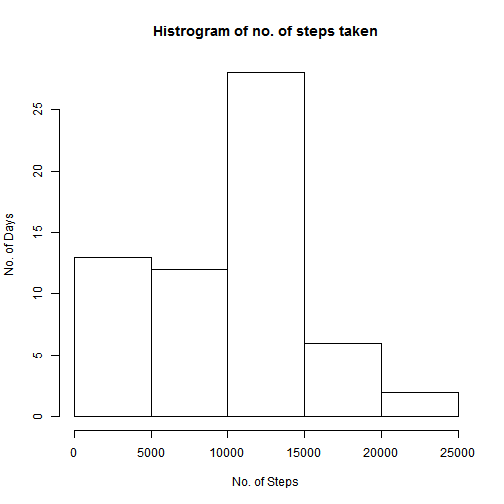
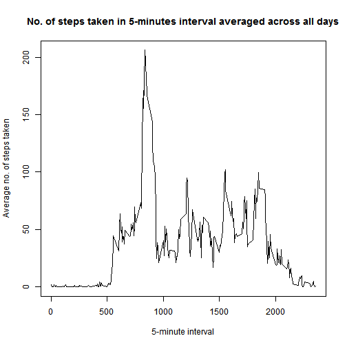
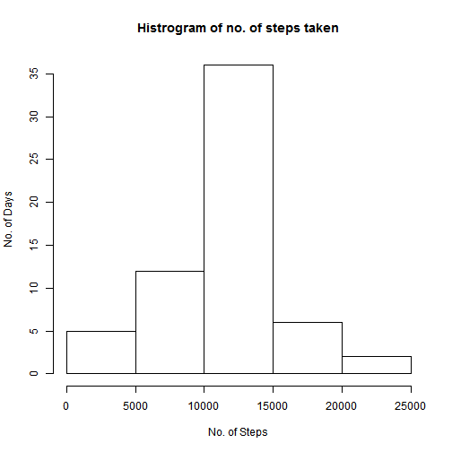
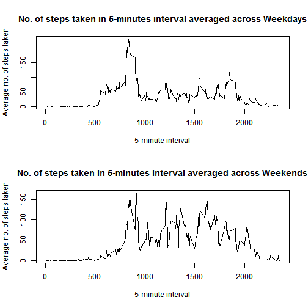

---
title: "Assignment 1"
output:
  html_document:
    pandoc_args: [
      "+RTS", "-K64m",
      "-RTS"
    ]
--- 
==============================================  
**Loading the data into R**

```r
file<-read.csv("activity.csv",stringsAsFactors=FALSE)
```

**What is mean total number of steps taken per day?**

```r
file1<-tapply(file$steps,file$date,FUN=sum,na.rm=TRUE)
```
Histrogram of No. of steps taken per day

```r
hist(file1,xlab="No. of Steps",ylab="No. of Days",main="Histrogram of no. of steps taken")
```

 

Mean of steps taken per day

```r
ceiling(mean(file1,na.rm=TRUE))
```

```
## [1] 9355
```
Median of steps taken per day

```r
median(file1,na.rm=TRUE)
```

```
## [1] 10395
```

**What is the average daily activity pattern?**

```r
file2<-aggregate(x=list(steps=file$steps),by=list(interval=file$interval),FUN=mean,na.rm=TRUE)
plot(file2,type="l",xlab="5-minute interval",ylab="Average no. of steps taken",main="No. of steps taken in 5-minutes interval averaged across all days")
```

 

On average across all the days in the dataset, which 5-minute interval contains the maximum number of steps?

```r
file2[which.max(file2$steps),]
```

```
##     interval    steps
## 104      835 206.1698
```
**Imputing Missing Values**  
No. of missing values

```r
sum(is.na(file$steps))
```

```
## [1] 2304
```
All of the missing values are filled in with mean value for that 5-minute interval

```r
file3<-transform(file,ms=ave(steps,interval,
               FUN=function(x) mean(x,na.rm=TRUE)))
file4<-transform(file3,steps=ifelse(is.na(steps),ms,steps))
file4$steps<-ceiling(file4$steps)
file5<-tapply(file4$steps,file4$date,FUN=sum,na.rm=TRUE)
hist(file5,xlab="No. of Steps",ylab="No. of Days",main="Histrogram of no. of steps taken")
```

 

```r
mean(file5)
```

```
## [1] 10784.92
```

```r
median(file5)
```

```
## [1] 10909
```
Difference between mean & median of data after & before imputing missing values

```r
mean(file5)-mean(file1)
```

```
## [1] 1430.689
```

```r
median(file5)-median(file1)
```

```
## [1] 514
```
**Are there differences in activity patterns between weekdays and weekends?**

```r
file4$day<-weekdays(as.Date(file4$date))
file4$wday<-factor(file4$day,levels=c("Monday","Tuesday","Wednesday","Thursday","Friday","Saturday","Sunday"),labels=c("Weekday","Weekday","Weekday","Weekday","Weekday","Weekend","Weekend"))
```

```
## Warning in `levels<-`(`*tmp*`, value = if (nl == nL) as.character(labels)
## else paste0(labels, : duplicated levels in factors are deprecated
```

```r
file5<-file4[which(file4$wday=="Weekday"),]
file6<-file4[which(file4$wday=="Weekend"),]
file7<-aggregate(x=list(steps=file5$steps),by=list(interval=file5$interval),FUN=mean,na.rm=TRUE)
file8<-aggregate(x=list(steps=file6$steps),by=list(interval=file6$interval),FUN=mean,na.rm=TRUE)
par(mfrow=c(2,1))
plot(file7,type="l",xlab="5-minute interval",ylab="Average no. of steps taken",main="No. of steps taken in 5-minutes interval averaged across Weekdays")
plot(file8,type="l",xlab="5-minute interval",ylab="Average no. of steps taken",main="No. of steps taken in 5-minutes interval averaged across Weekends")
```

 


